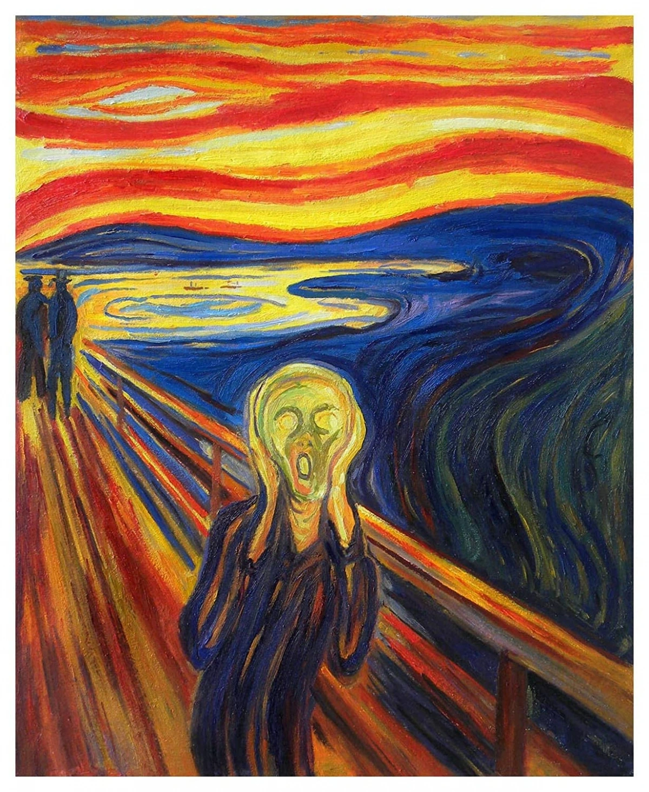
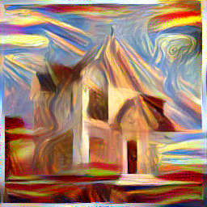
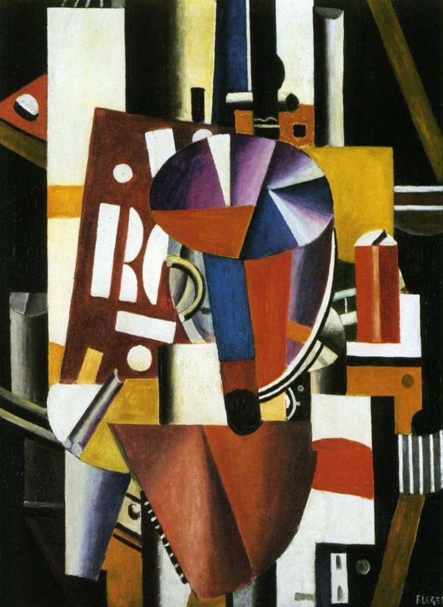
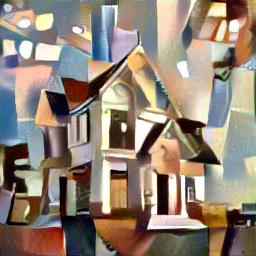

# Neural Style Transfer (Optimization-based)

This project implements **classical Neural Style Transfer** (Gatys et al.), where a generated image is **directly optimized** to preserve the content of one image and the style of another using a fixed pretrained VGG network.

Unlike fast style transfer approaches, this method **does not train a new model**.  
The output image itself is optimized via gradient descent.

---

## Method Overview

- Uses **VGG19** pretrained on ImageNet as a fixed feature extractor
- Content is preserved using high-level feature representations
- Style is represented using **Gram matrices**
- The generated image is optimized to minimize:

$$
\mathcal{L} = \alpha \cdot \mathcal{L}_{content} + \beta \cdot \mathcal{L}_{style}
$$

> No model weights are trained or saved.  
> The final stylized image is the result of the optimization process.

---

## Demo Results

### Content Image


### Style Image


### Stylized Result


---

### Content Image


### Style Image


### Stylized Result


---

### Content Image


### Style Image


### Stylized Result


---

## Project Structure

image-style-transfer/
├── notebooks/
│ └── 01_exploration.ipynb
├── src/
│ ├── utils.py
│ ├── model.py
│ ├── loss.py
│ ├── run_style_transfer.py
├── experiments/
│ └── exp_01/
│ └── config.yaml
│ └── notes.md
├── outputs/
│ └── images/
├── scripts/
│ └── run_exp.sh
├── requirements.txt
└── README.md

---

## Installation

### Requirements
- Python 3.9+
- PyTorch

Installing PyTorch may take several minutes.

### Setup (CPU-only recommended)

```bash
python3 -m venv venv
source venv/bin/activate
pip install -r requirements.txt
```

### Customize hyperparam in config.yaml

### Run

```bash
python3 src/run_style_transfer.py config.yaml
```


